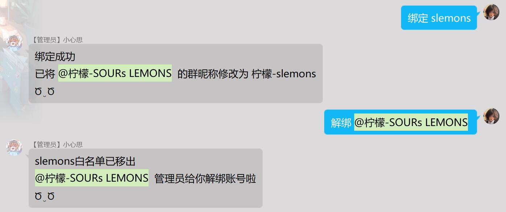

|     作者     | [SOURsLEMONS](https://github.com/SOURsLEMONS)                                              |
| :----------: | ------------------------------------------------------------------------------------------ |
|   **介绍**   | 普通成员绑定，退群解绑，管理员解绑成员，在机器人有群管理或群主权限时成员绑定自动更该群名片 |
| **更新日期** | 2022.10.16 (v1.0)                                                                          |
| **下载链接** | [GitHub](https://github.com/Zaitonn/Serein/blob/plugins/SLbind.js)                         |
| **开源仓库** | [GitHub](https://github.com/Zaitonn/Serein/blob/plugins/SLbind.js)                         |

### 使用方法

发送：*绑定 游戏昵称*  
即可绑定该游戏id并获得白名单  
>[!WARNING]在面板的设置中添加管理员QQ号才有权限使用

发送：*解绑 @群员*  
可以解除他的绑定并删除白名单

绑定以及解绑都会发送BDS原版白名单指令进行添加或删除白名单

>[!ATTENTION]该插件会修改原面板自带的退群事件文件，来实现退群解绑
