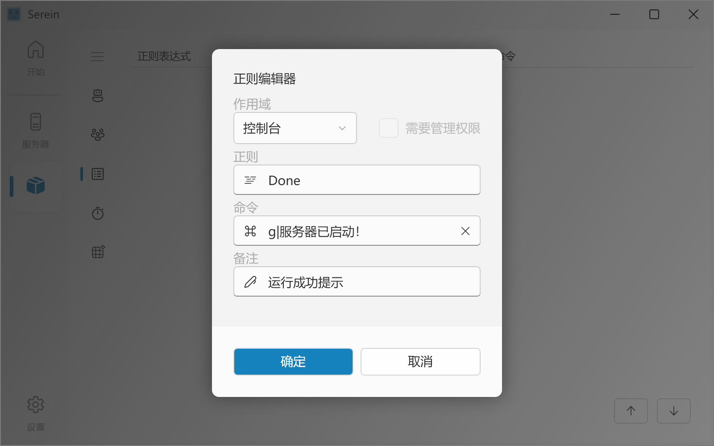
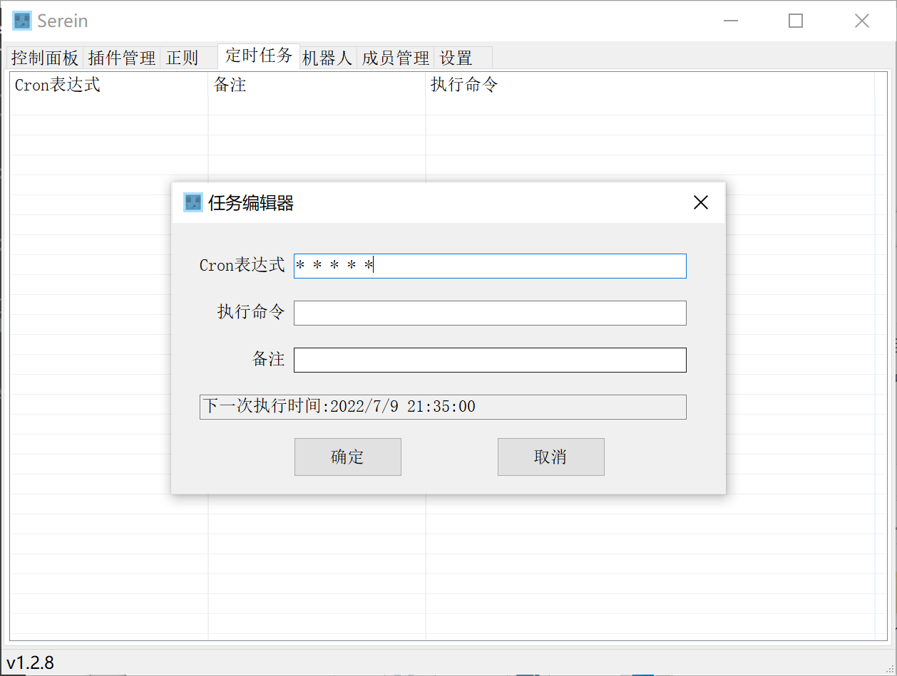
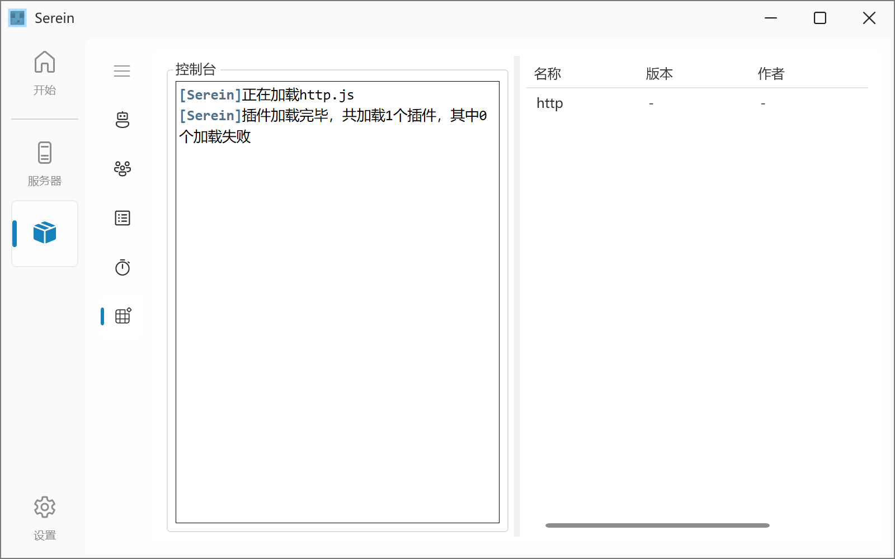

# 特色

## 📁 麻雀虽小五脏俱全

- **以极小的文件体积囊括多种功能**
- 截至v1.3.2，所有发行包大小均不超过3MB  
  也就是说，不到一张~~色图~~表情包体积的软件就可以实现控制服务器等功能
  

## 💻 超强的兼容性

- 已经经过测试的系统如下
  - Windows
    - Win7
    - Win10
    - Win11
    - WinServer2012
    - WinServer2016
    - WinServer2019
  - Linux *（不完全支持）*
- 支持启动的类型
  - 基岩版专用服务器（BDS)
  - Java版及使用`java`启动的服务器
  - ~~Jvav版及使用`jvav`启动的服务器~~
  - ~~`Serein` *你甚至可以套娃（bushi）*~~
  - **理论上支持所有支持命令行输出的可执行文件**
- 你甚至可以用[MCSM](https://mcsmanager.com)等软件套娃实现网页版面板

## 🔧 控制面板

- 简洁的状态信息显示
  - 显示有关服务器的主要信息，快捷了解当前服务器状态
  - 理论上**可适配所有服务器**
  - 据群友反馈，可以**启动BDS、Java乃至于Terraria服务器**
  - ~~只有你想不到，没有Serein做不到~~
  - 方便的一键控制按钮，包括大部分日常使用的操作，帮助您**一键管理服务器**
  - 简洁且可自定义的彩色控制台
  - 使用自研的正则处理原始输出中的彩色样式，并使用内嵌HTML渲染输出
  - 还有**语法高亮**的显示主题可供选择！可自动用不同颜色高亮Info、Error、Warning、插件前缀和长数字，使得更易于查找关键信息
  - 得益于使用内嵌浏览器渲染控制台，您可以[自定义](Tutorial/CustomConsole.md)背景图片、高亮颜色、高亮内容、字体大小颜色等风格
- 自动后台运行
  - 当服务器运行时关闭Serein将**自动最小化至托盘**，再也不用怕点错当场关服跑路
  - 只有当服务器不在运行中时才允许关闭Serein

## 🛒 服务器插件管理

- 自动识别插件文件夹，分组列出所有的插件
- 一键拖入窗口导入插件，帮助小白服主解决导入难题
- 快捷启用/禁用插件，快速排除问题和更新服务器内容
- 直达文件夹，再也不用怕插件太多找不到插件在哪

## 📜 正则  

- 简单易上手的正则表达式和[命令](Function/Command.md)，可以执行服务器指令、发送消息甚至备份存档（基于cmd，需要自行下载7z）等高级功能
- 自动校验准确性，有效防止错误的产生
- 通过此功能还能实现自动回复，与群信息互通和状态输出等功能

>更多介绍详见[正则](Function/Regex.md)

## ⏰ 定时任务

- 简单易上手的Cron表达式和[命令](Function/Command.md)，可以执行服务器指令、发送消息甚至备份存档（基于cmd命令行，需要自行下载7z）等高级功能
- 通过此功能还能实现定时命令、准点报时和定时备份等功能
- 自动提示下一次执行时间，再也不用怕搞出逆天的表达式了

>更多介绍详见[定时任务](Function/Task.md)

## 🤖 机器人

- 支持多种主流机器人，如[go-cqhttp](https://github.com/Mrs4s/go-cqhttp)、[OneBot Mirai](https://github.com/yyuueexxiinngg/onebot-kotlin)
- Serein与机器人窗口分离，方便拓展

>更多介绍详见[机器人](Function/Bot.md)

## 👨‍💼 成员管理

- 将用户的游戏ID与QQ号绑定，有效防止熊孩子使用小号作恶
- 一键添加/删除/修改绑定用户，快捷管理

>更多介绍详见[成员管理](Function/Member.md)

## 🧩 JS插件

- 你可以使用[他人编写好的插件](Extension/JS/Example.js.md)直接实现指定功能，方便服主使用
- 由于js引擎的特性，你可以在js中[插入部分C#代码](Function/JSDocs/README.md)，增添更多功能
- 提供二十余个函数可供使用和十余个事件可供监听
- 自定义机器人回复/交互/签到等功能

>更多介绍详见[插件](Function/JSPlugin.md)  [插件文档](Function/JSDocs/README.md)

## 🥖 其他

- **👨‍💻 独特的开发者**
  - 开发者本人有数年的开服经验，更能了解服主们的心声

---

- **💸 永不收费且无广告**
  - 自从一开始便确定不提供任何增值服务  
  - 软件中永远不会加入任何广告，广告统统给爷爪巴

---

- **🎤 永久免费咨询**
  - [加群](https://jq.qq.com/?_wv=1027&amp;k=XNZqPSPv)询问作者或群内其他用户，我们将会尽己所能提供解答和支持

---

- **📢 倾听用户声音**
  - 如果你有好的建议或者需求，都可以[加群](https://jq.qq.com/?_wv=1027&amp;k=XNZqPSPv)或[提交Issue](https://github.com/Zaitonn/Serein/issues/new)提出建议
