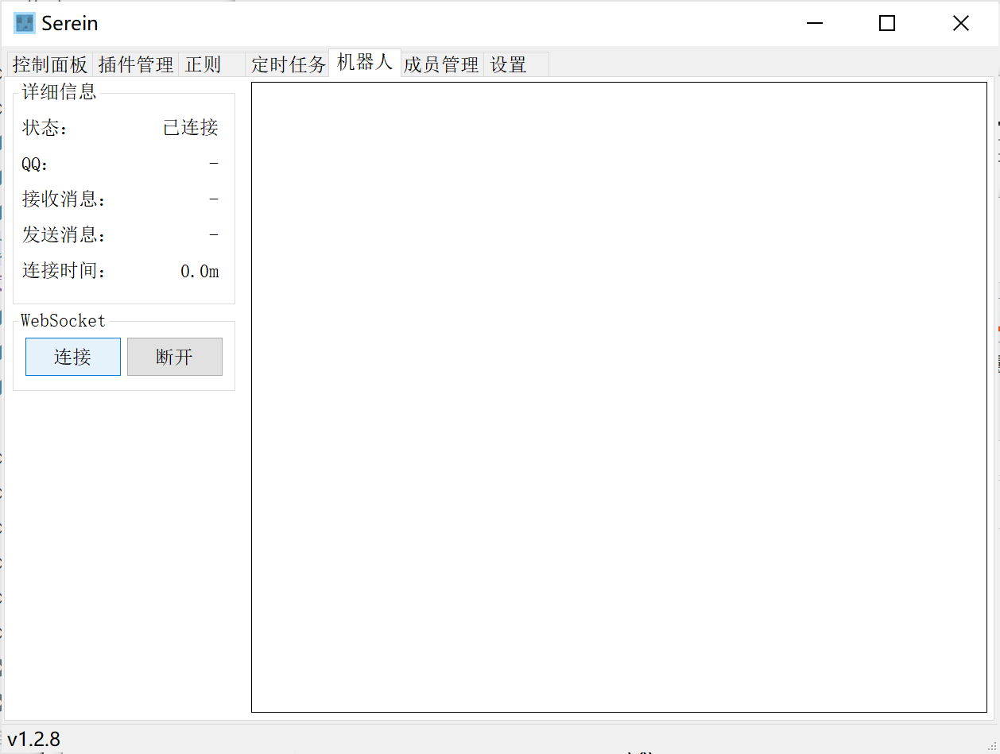

# 机器人

>用于连接机器人ws服务器接收消息

## 支持的条件

- 使用[OneBot-11](https://github.com/botuniverse/onebot-11)标准
  - 使用新[OneBot-12](https://12.onebot.dev/)标准的机器人不确定是否可用，可自行尝试
- 可使用WS正向连接

>[!WARNING]由于不同机器人之间标准可能存在差异，不一定保证100%适配所有机器人  
>目前已完全支持的机器人：
>
>- [go-cqhttp](https://github.com/Mrs4s/go-cqhttp)
>- [OneBot Mirai](https://github.com/yyuueexxiinngg/onebot-kotlin)  
>- *其他机器人暂未测试*

>[!TIP] 👉[机器人详细配置教程](Tutorial/Bot.md)👈
