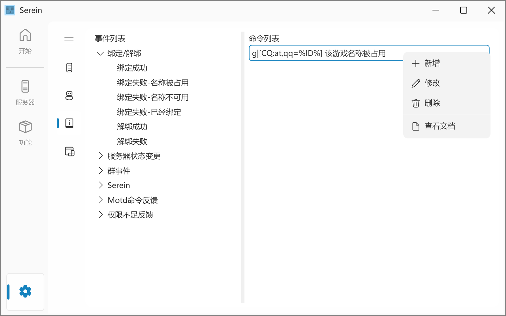

### 介绍

根据`settings/Event.json`中的设置的命令响应触发的事件  

在配置文件中，每个事件下有一个`JSON`数组，你可以在里面填写该事件被触发时执行的[命令](Command.md)，并且可以在其中插入[变量](Variables.md)

>[!WARNING]所有事件均无法使用[消息变量（私聊）](Variables.md#消息变量私聊)、[消息变量（群聊）](Variables.md#消息变量群聊)变量

<details>
  <summary>配置文件预览</summary>
  <code>
  <pre>
{
  "Notice": "在这里你可以自定义每个事件触发时执行的命令。参考：https://serein.cc/Command.html、https://serein.cc/Event.html",
  "Bind_Success": [
    "g|[CQ:at,qq=%ID%] 绑定成功"
  ],
  "Bind_Occupied": [
    "g|[CQ:at,qq=%ID%] 该游戏名称被占用"
  ],
  "Bind_Invalid": [
    "g|[CQ:at,qq=%ID%] 该游戏名称无效"
  ],
  "Bind_Already": [
    "g|[CQ:at,qq=%ID%] 你已经绑定过了"
  ],
  "Unbind_Success": [
    "g|[CQ:at,qq=%ID%] 解绑成功"
  ],
  "Unbind_Failure": [
    "g|[CQ:at,qq=%ID%] 该账号未绑定"
  ],
  "Server_Start": [
    "g|服务器正在启动"
  ],
  "Server_Stop": [
    "g|服务器已关闭"
  ],
  "Server_Error": [
    "g|服务器异常关闭"
  ],
  "Group_Increase": [
    "g|欢迎[CQ:at,qq=%ID%]入群~"
  ],
  "Group_Decrease": [
    "g|用户%ID%退出了群聊，已自动解绑游戏ID",
    "unbind|%ID%"
  ],
  "Group_Poke": [
    "g|别戳我……(*/ω＼*)"
  ],
  "Serein_Crash": [
    "g|唔……发生了一点小问题(っ °Д °;)っ\n请查看Serein错误弹窗获取更多信息"
  ],
  "Motdpe_Success": [
    "g|服务器描述：%Description%\n版本：%Version%(%Protocol%)\n在线玩家：%OnlinePlayer%/%MaxPlayer%\n游戏模式：%GameMode%\n延迟：%Delay%ms"
  ],
  "Motdje_Success": [
    "g|服务器描述：%Description%\n版本：%Version%(%Protocol%)\n在线玩家：%OnlinePlayer%/%MaxPlayer%\n延迟：%Delay%ms\n%Favicon%"
  ],
  "Motd_Failure": [
    "g|Motd获取失败\n详细原因：%Exception%"
  ],
  "PermissionDenied_Private": [
    "p|你没有执行这个命令的权限"
  ],
  "PermissionDenied_Group": [
    "g|[CQ:at,qq=%ID%] 你没有执行这个命令的权限"
  ]
}
  </pre>
  </code>
</details>

### 事件一览表

>[!WARNING]以下所有事件均无法使用[消息变量（私聊）](Variables.md#消息变量私聊)、[消息变量（群聊）](Variables.md#消息变量群聊)变量

| 事件名                   | 描述                           |
| ------------------------ | ------------------------------ |
| Bind_Success             | 绑定成功                       |
| Bind_Occupied            | 绑定失败-游戏ID占用            |
| Bind_Invalid             | 绑定失败-该游戏ID不符合规范    |
| Bind_Already             | 绑定失败-该QQ已经绑定          |
| Unbind_Success           | 解绑成功                       |
| Unbind_Failure           | 解绑成功                       |
| Server_Start             | 服务器启动                     |
| Server_Stop              | 服务器正常关闭                 |
| Server_Error             | 服务器异常退出                 |
| Group_Increase           | 监听群有人进群                 |
| Group_Decrease           | 监听群有人退群                 |
| Group_Poke               | 监听群内当前账号被他人戳一戳   |
| Motdpe_Success           | 命令`motdpe`执行成功           |
| Motdje_Success           | 命令`motdje`执行成功           |
| Motd_Failure             | 命令`motdpe`或`motdje`执行失败 |
| PermissionDenied_Private | 权限不足（私聊）               |
| PermissionDenied_Group   | 权限不足（群聊）               |
| Serein_Crash             | `Serein`崩溃                   |

### 绑定/解绑

>[!WARNING]本节的所有事件可以使用`ID`变量获取触发这个事件的QQ

#### Bind_Success

绑定成功  
默认值： `g|[CQ:at,qq=%ID%] 绑定成功`

#### Bind_Occupied

游戏ID占用  
默认值： `g|[CQ:at,qq=%ID%] 该游戏名称被占用`

#### Bind_Invalid

该游戏ID不符合规范  
默认值： `g|[CQ:at,qq=%ID%] 该游戏名称无效`

#### Bind_Already

该QQ已经绑定  
默认值： `g|[CQ:at,qq=%ID%] 你已经绑定过了`

#### Unbind_Success

解绑成功  
默认值： `g|[CQ:at,qq=%ID%] 解绑成功`

#### Unbind_Failure

解绑成功  
默认值： `g|[CQ:at,qq=%ID%] 该账号未绑定`

### 服务器状态变更

#### Server_Start

服务器启动
默认值： `g|服务器正在启动`

#### Server_Stop

服务器正常关闭
默认值： `g|服务器已关闭`

#### Server_Error

服务器异常退出  
默认值： `g|服务器异常关闭`

### QQ群事件

>[!WARNING]本节的所有事件可以使用`ID`变量获取触发这个事件的QQ

#### Group_Increase

监听群有人进群  
默认值： `g|欢迎[CQ:at,qq=%ID%]入群~`

#### Group_Decrease

监听群有人退群  
默认值：

```txt
g|用户%ID%退出了群聊，已自动解绑游戏ID
ubind|%ID%
```

#### Group_Poke

监听群内当前账号被他人戳一戳  
默认值： `g|别戳我……(*/ω＼*)`

>[!TIP]
>以上三个事件其实很有用，可以欢迎新成员/引导玩家绑定ID/快捷获取服务器状态/提示退群消息/~~整活~~  
>
>- 示例：
>
>   ```txt
>   [CQ:at,qq=%ID%] 呐呐呐~！欢迎来到XXX服务器★(笑)♡今后也.请.多.多.指.教.喔?~
>   ```
>
>   ```txt
>   [CQ:at,qq=%ID%]
>   服务器描述：Dedicated Server
>   版本：1.19.2(527)
>   在线玩家：0/10
>   游戏模式：Survival
>   延迟：114.514ms
>   ```

### Motd指令反馈

#### Motdpe_Success

命令`motdpe`执行成功  
默认值：

```txt
g|
服务器描述：%Description%
版本：%Version%(%Protocol%)
在线玩家：%OnlinePlayer%/%MaxPlayer%
游戏模式：%GameMode%
延迟：%Delay%ms
```

#### Motdje_Success

命令`motdje`执行成功  
默认值：

```txt
g|
服务器描述：%Description%
版本：%Version%(%Protocol%)
在线玩家：%OnlinePlayer%/%MaxPlayer%
延迟：%Delay%ms
%Favicon%
```

#### Motd_Failure

命令`motdpe`或`motdje`执行失败  
默认值：

```txt
g|
Motd获取失败
%Exception%
```

>[!WARNING]`Motd_Failure`可以使用额外的`Exception`变量输出错误信息

### 权限不足反馈

#### PermissionDenied_Private

当没有管理权限的用户通过私聊方式触发了需要权限的命令时触发
默认值：`p|你没有执行这个命令的权限`

#### PermissionDenied_Group

当没有管理权限的用户通过群聊方式触发了需要权限的命令时触发
默认值：`g|[CQ:at,qq="id"] 你没有执行这个命令的权限`

### Serein

#### Serein_Crash

`Serein`崩溃  
默认值：

```txt
g|
唔……发生了一点小问题(っ °Д °;)っ
请查看Serein错误弹窗获取更多信息
```
