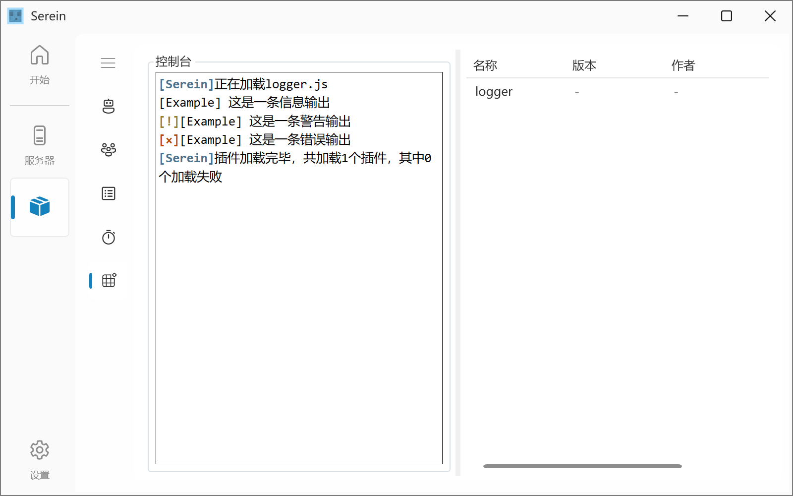

# 类

## WebSocket客户端

```js
// 由于该js解释器不支持ws，所以这里用C#封装了一个，部分方法和js原生的有所不同
var ws = new WSClient("ws://127.0.0.1:11451", serein.namespace); 
// 实例化ws，
// 此处需要提供当前的命名空间，用于区分和管理

ws.onopen = function(){
  // ws开启事件
  // ...
};
ws.onclose = function(){
  // ws关闭事件
  // ...
};
ws.onerror = function(e){ // 错误信息
  // ws发生错误事件
  // ...
};
ws.onmessage = function(message){ // 收到数据
  // ws收到数据事件
  // ...
};

ws.open(); // 连接ws
var state = ws.state; // 连接状态
/*
 * 此状态有以下五个可能的枚举值
 *  -1  未知或无效
 *  0   正在连接
 *  1   连接成功
 *  2   正在关闭
 *  3   已关闭
*/
ws.send("hello"); // 发送数据
ws.close(); // 关闭ws
ws.dispose(); // 释放对象
```

## Logger

```js
var logger = Logger("Example"); // 插件名称
logger.info("这是一条信息输出");
logger.warn("这是一条警告输出");
logger.error("这是一条错误输出");
logger.debug("这是一条信息输出"); // 此消息将输出到Serein的debug窗口而不是插件控制台
```



## Motdje/Motdpe

~~Jvav~~版和基岩版的Motd对象

```js
let motd = new Motdje('1.2.3.4:1234'); // 地址
```

### 属性

- MaxPlayer 最大玩家数
- OnlinePlayer 在线玩家数
- Description 服务器描述
- Protocol 协议
- LevelName 存档名称 *仅基岩版*
- GameMode 游戏模式 *仅基岩版*
- Favicon 图标（CQ码）*仅Java*
- Delay.TotalMilliseconds 延迟（ms）
- Origin 原文
- Exception 错误消息
- IsSuccess 是否获取成功

### 默认值

>详见<https://github.com/Zaitonn/Serein/blob/main/Serein/Universal/Items/Motd/Motd.cs>
