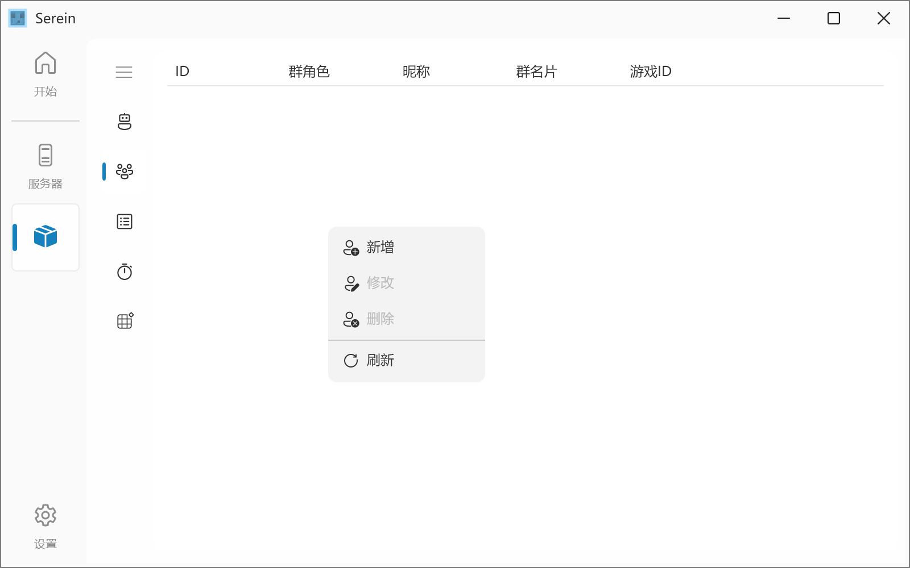

# 成员管理

>管理QQ号与游戏ID的绑定关系



任务数据保存在 data/menbers.json

## 食用方法

- 通过触发命令[bind/unbind](Function/Command.md#绑定游戏id)进行操作
  - 游戏ID校验正则：`^[a-zA-Z0-9_\s-]{4,16}$`
    - 长度为4-16
    - 仅含有大小写英文字符、下划线、空格
- 通过[JavaScript插件](Function/JSDocs/Func.md#👨🏻🤝👨🏻-绑定解绑)执行`serein.bindMember()`或`serein.unbindMember()`增删绑定记录
- 在列表中右键可编辑绑定的游戏ID或删除所选记录

## 文件格式

```json
{
  "type": "MEMBERS",
  "comment": "非必要请不要直接修改文件，语法错误可能导致数据丢失",
  "data": [
    {
      "ID": 10001, // QQ号
      "Card": "群名片",
      "Nickname": "昵称",
      "Role": 1, // 群角色类型，0=群主，1=管理员，2=普通群员
      "GameID": "Li_Tiansuo" // 游戏ID
    }
  ]
}
```
