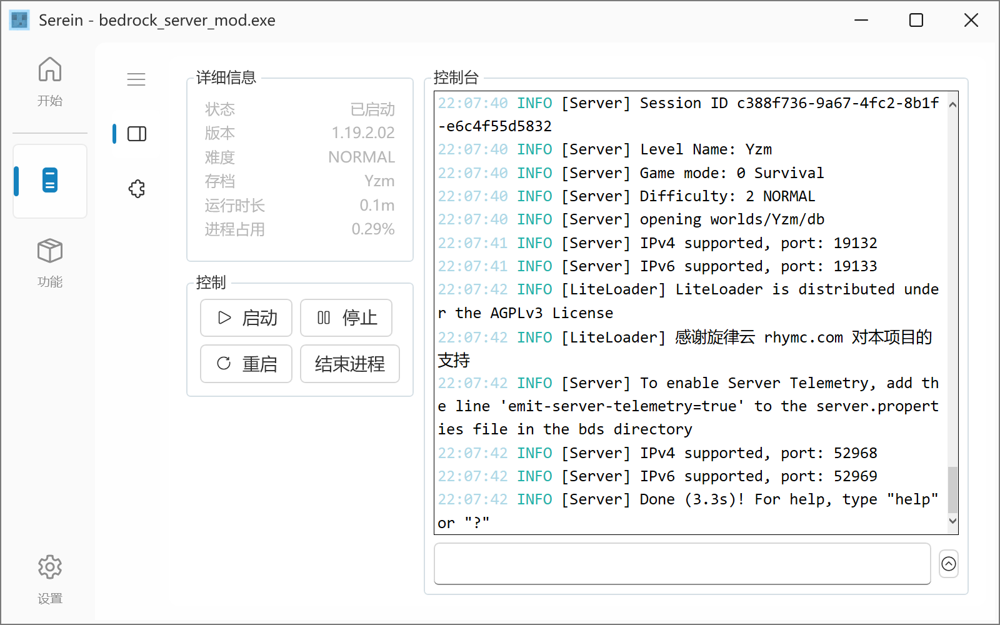

# Serein 是什么

    
    
    
    
    
    
    

Serein 是一个基于NET 6或NET Framework 4.7.2的新时代我的世界极简服务器面板

## 运行环境

- Win7 / WinServer2012以上
- Linux

>[!WARNING] 更低的版本以及其他系统不保证能稳定运行，必要时务必备份数据  

## 运行库

- 由于大部分系统自带.NET Framework 4.7.2运行库，可以选择下载Serein net472版本，不需要再安装
- 根据下载的版本自行选择即可，并不都要安装  

