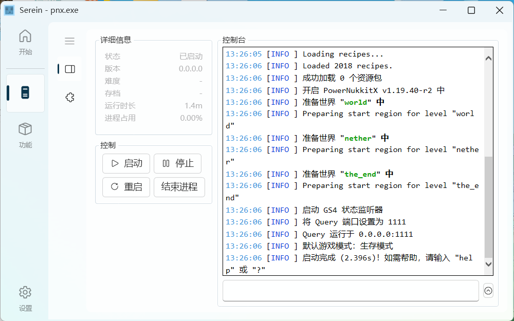
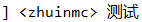
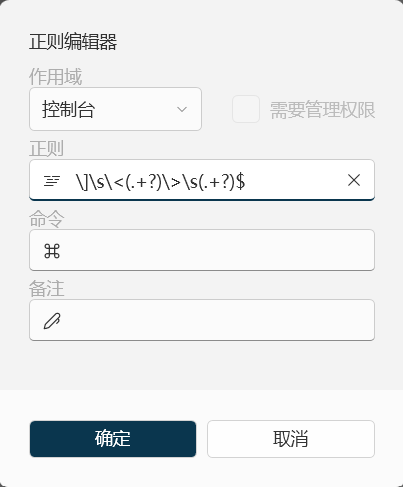
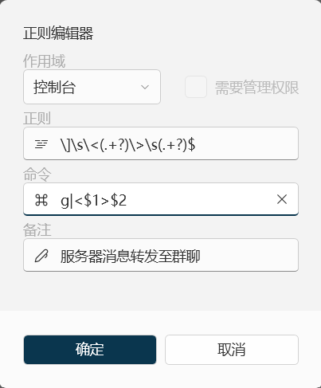
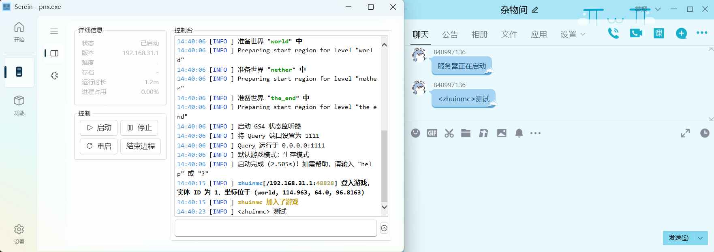
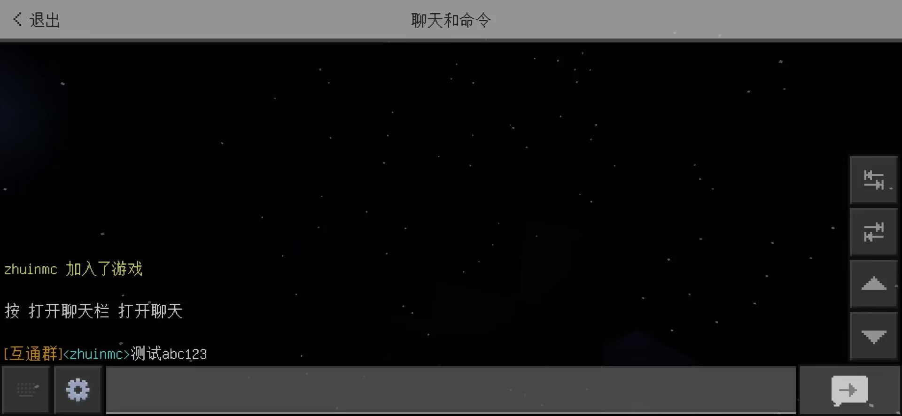

# 自定义正则

>[!NOTE]
>
>- 转载自[@azhunotfound](https://pdumc.top/#/serein)，并有所改动
>- 本文以基岩版服务器核心`PowerNukkitX`实现`群聊-服务器`聊天互通为例，以下简称其为`PNX`

## 准备

1. Serein面板  
2. 正常运行的PNX服务器  
3. ~~智商正常的脑子，视力正常的眼睛~~

### 学习正则表达式

开始之前你需要大致了解下文中的正则表达式字符代表的意思

| 字符                                                                                                                                                                             | 描述                                                                                                                                                                                                                                                     |
| -------------------------------------------------------------------------------------------------------------------------------------------------------------------------------- | -------------------------------------------------------------------------------------------------------------------------------------------------------------------------------------------------------------------------------------------------------- |
| \\|将下一个字符标记为一个特殊字符、或一个原义字符、或一个 向后引用、或一个八进制转义符。例如，'n' 匹配字符 "n"。'\n' 匹配一个换行符。序列 '\\\\' 匹配 "\\" 而 "\\(" 则匹配 "("。 |
| \^                                                                                                                                                                               | 匹配输入字符串的开始位置。如果设置了 RegExp 对象的 Multiline 属性，^ 也匹配 '\n' 或 '\r' 之后的位置。                                                                                                                                                    |
| \$                                                                                                                                                                               | 匹配输入字符串的结束位置。如果设置了RegExp 对象的 Multiline 属性，$ 也匹配 '\n' 或 '\r' 之前的位置。                                                                                                                                                     |
| \n                                                                                                                                                                               | 匹配一个换行符。等价于 \x0a 和 \cJ。                                                                                                                                                                                                                     |
| +                                                                                                                                                                                | 匹配前面的子表达式一次或多次。例如，'zo+' 能匹配 "zo" 以及 "zoo"，但不能匹配 "z"。+ 等价于 {1,}。                                                                                                                                                        |
| ?                                                                                                                                                                                | 当该字符紧跟在任何一个其他限制符 (*, +, ?, {n}, {n,}, {n,m}) 后面时，匹配模式是非贪婪的。非贪婪模式尽可能少的匹配所搜索的字符串，而默认的贪婪模式则尽可能多的匹配所搜索的字符串。例如，对于字符串 "oooo"，'o+?' 将匹配单个 "o"，而 'o+' 将匹配所有 'o'。 |
| .                                                                                                                                                                                | 匹配除换行符（\n、\r）之外的任何单个字符。要匹配包括 '\n' 在内的任何字符，请使用像"(.\|\n)"的模式。                                                                                                                                                      |

> 更多字符含义详见[正则表达式 - 菜鸟教程](https://www.runoob.com/regexp/regexp-metachar.html)

## 开始

### 服务器消息转发进QQ群

1. 在Serein面板里启动PNX服务器  

1. 进入服务器并在服务器内随意发送一条消息并复制这条消息的控制台输出  

3. 打开正则表达式添加页面新建一条正则表达式，作用域选择*控制台*，并把刚刚复制的控制台输出粘贴在正则输入框内
4. 在特殊符号前面加上`\`将它转换为原意字符，空格替换为`\s`用于匹配空格，玩家名和玩家消息替换为`(.+?)`，末尾加上符号`$`表示匹配至这段字符的末端  

5. 填写命令

```Serein命令
g|$1 $2
```


`g`代表发送至QQ群，`$1`代表正则表达式内第一个匹配项也就是玩家名，`$2`代表第二个匹配项也就是玩家发送的消息，则发送至QQ群的消息样式为`玩家名 玩家消息`

当然你也可以自定义字符美化发送至QQ群内的消息，例如  

```Serein命令
g|<$1>$2
```

发送至QQ群的消息格式就会变为`<玩家名>消息`  

现在我们连上机器人进服测试一下


**恭喜！现在服务器内的消息可以发送进QQ群了**

>[!TIP]如果监听了多个QQ群需要指定消息发送的群，需要把命令中的`g`改为`g:群号`

### QQ群消息转发进服务器

>[!TIP]这里使用[`tellraw`](https://minecraft.fandom.com/zh/wiki/%E5%91%BD%E4%BB%A4/tellraw)指令将消息从控制台发送给服务器内玩家，其他可以从控制台使用指令发送给所有玩家的指令本教程同样适用  
tellraw指令用法：/tellraw <player: target> <rawtext: rawtext>
>
>- 你需要注意的是，基岩版和Java版的`rawtext`语法有所不同，详见[原始JSON文本格式](https://minecraft.fandom.com/zh/wiki/%E5%8E%9F%E5%A7%8BJSON%E6%96%87%E6%9C%AC%E6%A0%BC%E5%BC%8F)，[基岩版原始JSON文本格式](https://minecraft.fandom.com/zh/wiki/%E5%9F%BA%E5%B2%A9%E7%89%88%E5%8E%9F%E5%A7%8BJSON%E6%96%87%E6%9C%AC%E6%A0%BC%E5%BC%8F)

1. 新建一条正则，作用域选`消息（群聊）`
2. 正则输入框填写如下正则

```regex
^(.+?)$
```

上面的正则表达式会转发群内所有消息至服务器，如果想只转发带`#`前缀的消息则应写成如下样式

```regex
^#(.+?)$
```

3. 命令输入框填写匹配到字符串后服务器执行的指令

```Serein命令
s|tellraw @a {"rawtext":[{"text":"[互通群]<%ShownName%>$1"}]}
```

当然你也可以在发送进服务器的消息内增加颜色符号改变文本颜色，示例如下

```Serein命令
s|tellraw @a {"rawtext":[{"text":"§6[互通群]§b<%ShownName%>§f$1"}]}
```

现在我们在机器人监听的群里发送一条消息测试一下  



**恭喜！现在QQ群内的消息可以发送进服务器了！**
