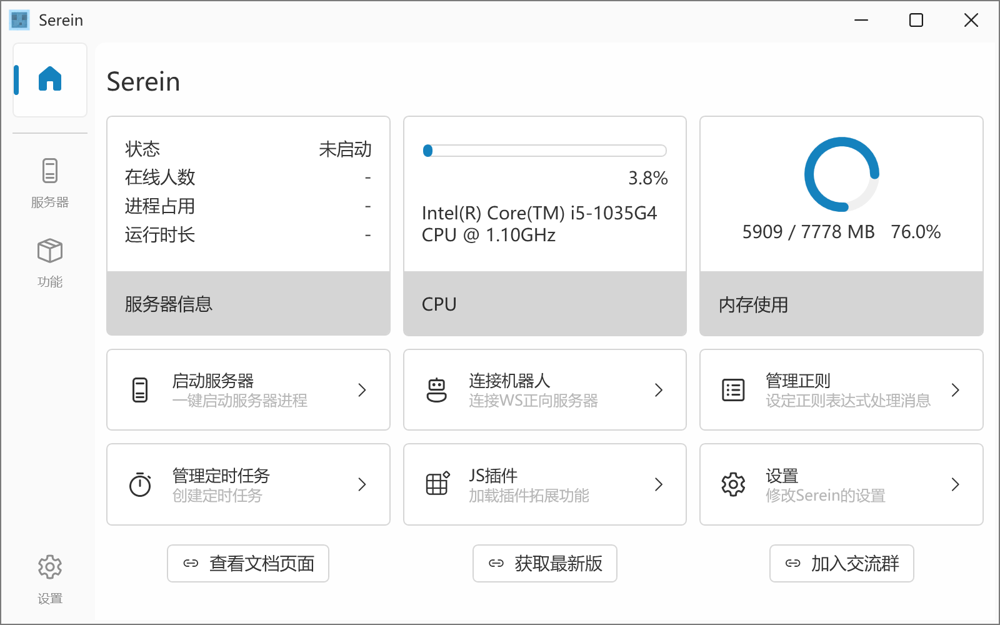
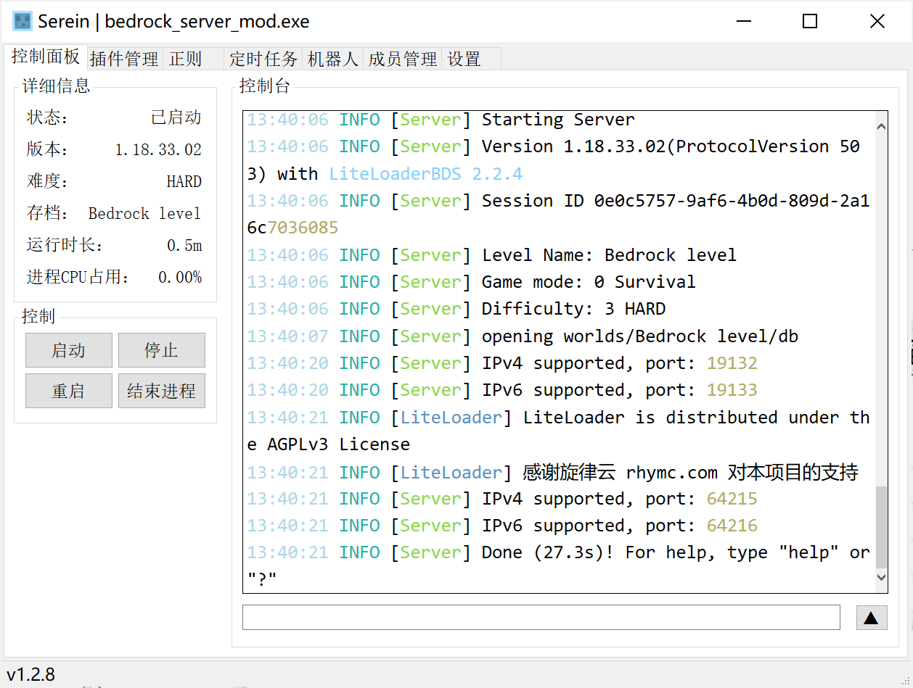

# 版本差异

>Serein不同版本类型之间的差异

>[!NOTE]统一的文件名格式：Serein-[类型]\_[版本号]\_[运行库NET版本号].zip  
实际上以下版本大部分代码是完全相同的，所以你也可以将所有版本放在同一目录下启动

## Serein类型

### 普通版（WPF）

- 有着更精美的界面Ui
- 适合小白服主使用

>[!NOTE] 建议win10或win11使用，win7下存在一定的渲染问题

### 极简版（Winform）
  
- 顾名思义，这种版本提供了极简的图形化操作界面
- 相同情况下占用更低，运行更流畅

### 命令行版（Console）

- 没有图形化窗口，而是纯命令行式，大部分操作都需要输入命令来完成
- 适合有一定开服基础或者面板服商家使用（门槛可能会有一点点高）
- 这种版本更适用于群组服，可以极大降低系统占用

## 运行库NET版本

- .NET Framework 4.7.2 **（推荐）**
  - Win10及以上等大部分系统自带，可不需要手动安装，方便使用
  - 软件测试主要针对此版本，NET6可能存在未知bug
- .NET 6.0
  - 运行速度较快，若追求处理速度可选择此版本
    >[!NOTE]详见 [Performance Improvements in .NET 6 （.NET 6 中的性能改进）](https://devblogs.microsoft.com/dotnet/performance-improvements-in-net-6/)
  - 但是系统一般不自带运行库，需自行安装
