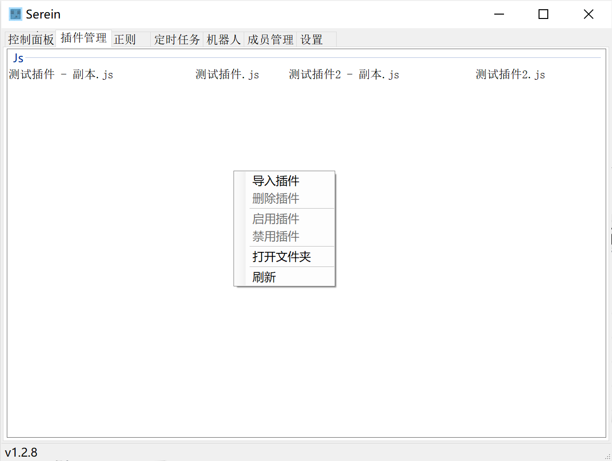

# 服务器插件管理

## 右键菜单

- 导入
  - 打开选择文件窗口一键导入
- 删除
  - 永久删除所选文件
- 启用 禁用
  - 以上两个功能实质是在插件的文件名后面增加`.lock`使加载器不能识别，并不更改插件文件内容
  - 禁用功能在服务器运行时不可用
- 打开文件夹
  - 在资源管理器中显示插件文件夹或所选插件

## 导入方法

- 将所选插件直接拖入窗口
- 右键选择导入，在打开的对话框中选择文件
