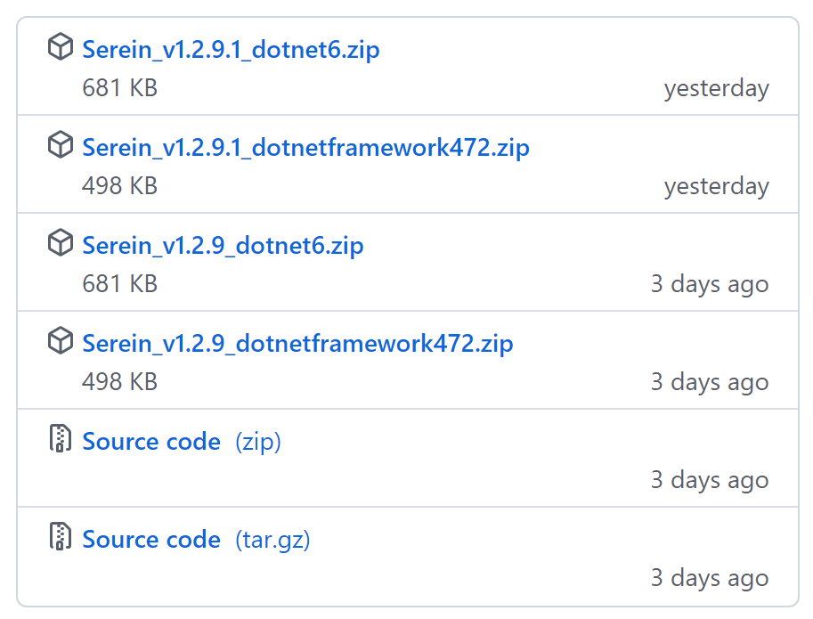
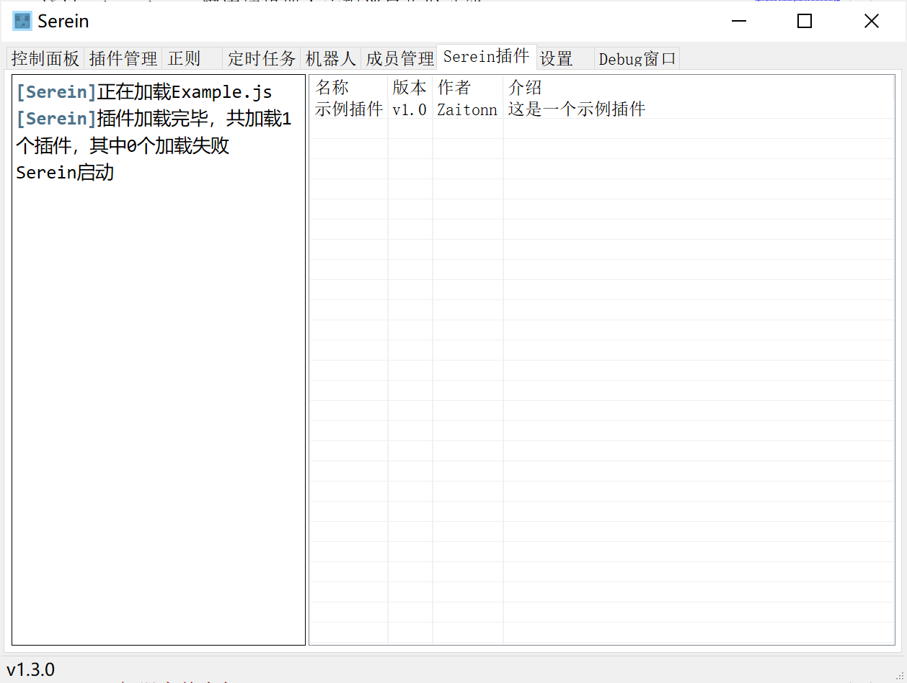
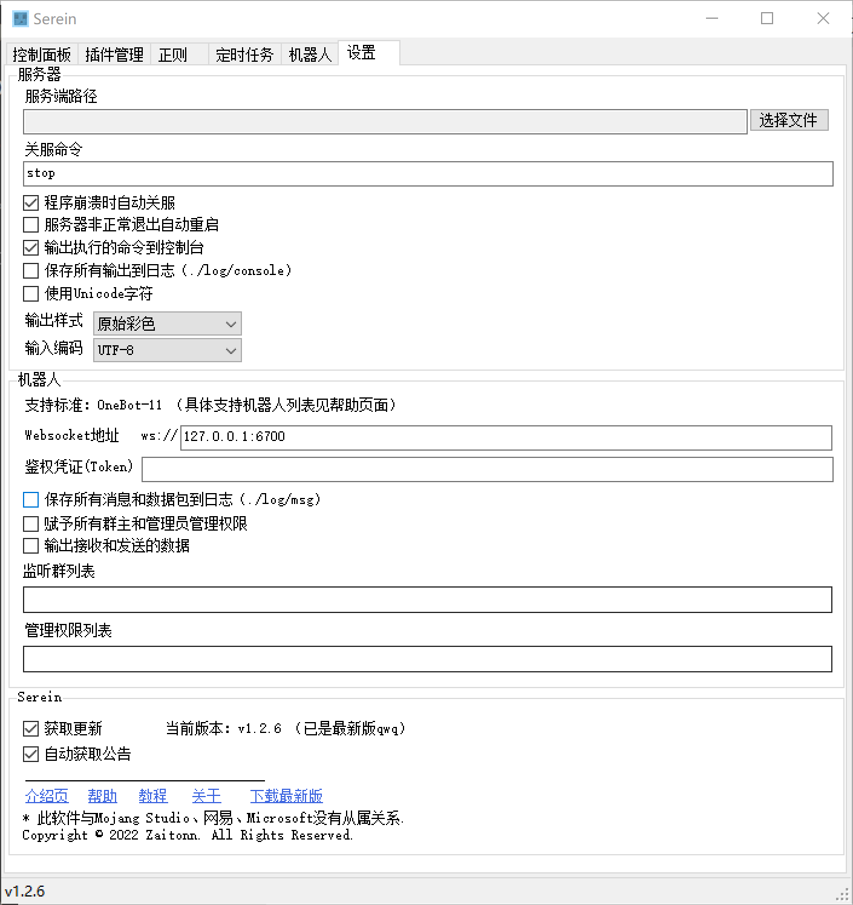

    
     
    
    
    
    
    
    

- 一个基于`NET 6`和`NET Framework 4.7.2`的新时代我的世界极简服务器面板
- **下载最新版：[https://github.com/Zaitonn/Serein/releases/latest](https://github.com/Zaitonn/Serein/releases/latest)**
- Github仓库：[https://github.com/Zaitonn/Serein](https://github.com/Zaitonn/Serein)
- Minebbs：[https://www.minebbs.com/resources/serein.4169/](https://www.minebbs.com/resources/serein.4169/)
- 查看 **[教程](Tutorial.md)** 丨 __[帮助](Help.md)__ 

---

- [🖥运行环境 Environment](#运行环境-environment)
  - [缺少运行库？](#缺少运行库)
- [💖特点 Feature](#特点-feature)
  - [Serein](#serein)
    - [麻雀虽小，五脏俱全](#麻雀虽小五脏俱全)
    - [永不收费且无广告](#永不收费且无广告)
    - [咨询](#咨询)
    - [倾听用户声音](#倾听用户声音)
  - [控制面板](#控制面板)
    - [简洁的状态信息显示](#简洁的状态信息显示)
    - [方便的一键控制按钮](#方便的一键控制按钮)
    - [简单且可自定义的彩色控制台](#简单且可自定义的彩色控制台)
    - [日志系统](#日志系统)
    - [自动后台运行](#自动后台运行)
  - [插件管理](#插件管理)
  - [正则](#正则)
  - [定时任务](#定时任务)
  - [机器人](#机器人)
  - [成员管理](#成员管理)
  - [Javascript插件](#javascript插件)
  - [设置](#设置)
- [✨正则/插件/整合包 Plugin](#正则插件整合包-plugin)
- [💖发电 Donate](#发电-donate)
- [📒关于 About](#关于-about)

---

## 🖥运行环境 Environment

Win7或WinServer2012以上

> 更低的系统版本不保证能稳定运行，必要时务必备份数据  

> 32位理论可正常运行`.NET Framework 4.7.2`的版本，但考虑到其他部分软件不支持，故还是推荐使用64位

### 缺少运行库？

>根据下载的版本自行选择即可，并不一定两个都需要安装

>Win10和WinServer2019以上应该有自带的`.NET Framework 4.7.2`运行库，可以不需要再安装

## 💖特点 Feature

### Serein

#### 麻雀虽小，五脏俱全

极小的文件体积，囊括多种功能  

截至`Serein v1.2.9`，`Serein`的**所有发行包大小均不超过1MB**  
也就是说，不到一张~~色图~~表情包体积的软件就可以实现控制服务器等功能

#### 永不收费且无广告

`Serein`自从一开始便确定了这一发展路线，在软件中不提供任何增值服务  

软件中永远不会加入任何广告，广告统统给爷爪巴

#### 咨询

[加群](https://jq.qq.com/?_wv=1027&amp;k=XNZqPSPv)询问作者或群内其他用户，我们将会尽己所能提供解答和支持

#### 倾听用户声音

如果你有好的建议或者需求，都可以[加群](https://jq.qq.com/?_wv=1027&amp;k=XNZqPSPv)或提交Issue提出建议

### 控制面板

#### 简洁的状态信息显示

- **显示有关服务器的主要信息**（状态、版本、难度、存档名称、运行时长和启动进程的CPU占用率），快捷了解当前服务器状态
- 理论上**可适配所有服务器**（包括BE和JE服务器），若遇无法识别可以自行修改配置文件

#### 方便的一键控制按钮

- 包括大部分日常使用的操作，帮助您一键管理服务器

#### 简单且可自定义的彩色控制台

- 使用自研的正则处理原始输出中的彩色样式，并使用内嵌HTML渲染输出
  - **目前仅有少数几个面板支持输出彩色日志，而Serein是其中之一！**
- 还有`语法高亮`的显示主题可供选择！可自动用不同颜色高亮`Info`、`Error`、`Warning`、插件前缀和长数字
- 得益于使用内嵌浏览器渲染控制台，故您可以在`./console`文件夹中自定义背景颜色、高亮颜色、高亮内容、字体大小颜色等风格
  > 可能需要一点点HTML5、CSS3和JS的入门技巧

#### 日志系统

> 此功能需在设置中开启

自动将控制台中的输出输出到日志文件，不用担心后台刷屏找不到想要的信息了

#### 自动后台运行

- 当服务器运行时关闭Serein将自动最小化至托盘，再也不用怕点错当场关服跑路

### 插件管理

- 自动识别插件文件夹，分组列出所有的插件
- 一键导入插件，帮助小白服主解决导入难题
- 快捷启用/禁用插件，快速排除问题和更新服务器
- 直达文件夹，再也不用怕插件太多找不到插件在哪
  
### 正则

- 简单易上手的正则表达式和[命令](Command.md)，可以执行服务器指令、发送消息甚至备份存档（基于cmd，需要自行下载7z）等高级功能
  - *你可以咨询作者获取详细方法*
- 通过此功能还能实现自动回复，与群信息互通和状态输出等功能
- 支持备注功能，再也不用担心写的是啥
- 简单明了的配置文件，可快捷分享或一键导入

### 定时任务

- 简单易上手的Cron表达式和[命令](Command.md)，可以执行服务器指令、发送消息甚至备份存档（基于cmd命令行，需要自行下载7z）等高级功能
  - *你可以咨询作者获取详细方法*
- 通过此功能还能实现定时命令、准点报时和定时备份等功能
- 自动提示下一次执行时间，再也不用怕搞出逆天的表达式了
- 支持备注功能，再也不用担心写的是啥
- 简单明了的配置文件，可快捷分享或一键导入

### 机器人

- 支持多种主流机器人，包括但不限于[`go-cqhttp`](https://github.com/Mrs4s/go-cqhttp)、[`OneBot Mirai`](https://github.com/yyuueexxiinngg/onebot-kotlin)
- `Serein`与机器人窗口分离，方便拓展
  > **⭐ Tips**
  >你可以使用`Nonebot`、`Nonebot2`等机器人框架继续拓展实现更多功能
- 通过Websocket一键连接机器人实现消息收发功能
- 允许多开`Serein`实现群组服的消息互通功能
- 显示状态和其他统计信息，帮助您了解运行状态
- 可以直接通过QQ控制服务器或消息互通（需要自行配置）

### 成员管理

- 将用户的游戏ID与QQ号绑定，有效防止熊孩子使用小号作恶
- 一键删除/修改绑定用户，快捷管理

### Javascript插件

- 你可以使用他人编写好的插件直接实现指定功能，方便服主使用
- 炒鸡详细的API文档→[Javascript函数](Javascript.md)
- 由于js引擎的特性，你可以在js中插入部分`C#`代码，增添更多功能
- 提供二十余个函数可供使用和十余个事件可供监听
- 自定义机器人回复/交互/签到等功能

### 设置

> 设置内容因版本不同而有所差别，图片仅供参考

- 提供尽可能多的设置，满足不同服主的使用需求
- 将鼠标指针放在不同设置上方，可查看关于这一项的详细提示，不用担心不明白设置的意思

## ✨正则/插件/整合包 Plugin

> 你需要自行判断其安全性和可用性，使用时出现问题与`Serein`无关

- 👉[**正则示例文件（官方）**](Regex_Demo.html)👈
- [Serein机器人整合包](https://www.minebbs.com/threads/serein.12192/)
- [Serein - 新的机器人内置常用正则](https://www.minebbs.com/resources/serein.4204/)

## 💖发电 Donate

>如果觉得这个软件对你很有帮助的话可以稍微鼓励一下作者  
我会很感谢你的(*￣3￣)╭❤

| Supporters                                                               | 发电金额 | 日期      |
| ------------------------------------------------------------------------ | -------: | --------- |
| [c设阿森_Asen](https://q.qlogo.cn/g?b=qq&k=tSKwDJ8UqzSUZRRYxElIFQ&s=100) |  $ 10.00 | 2022.7.25 |
| [binggggg](https://www.minebbs.com/members/binggggg.12096/)              |   ￥20.00 | 2022.7.17 |
| [binggggg](https://www.minebbs.com/members/binggggg.12096/)              |   ￥20.00 | 2022.7.10 |
| [binggggg](https://www.minebbs.com/members/binggggg.12096/)              |   ￥20.00 | 2022.7.9  |

## 📒关于 About

> [About](About.md)
