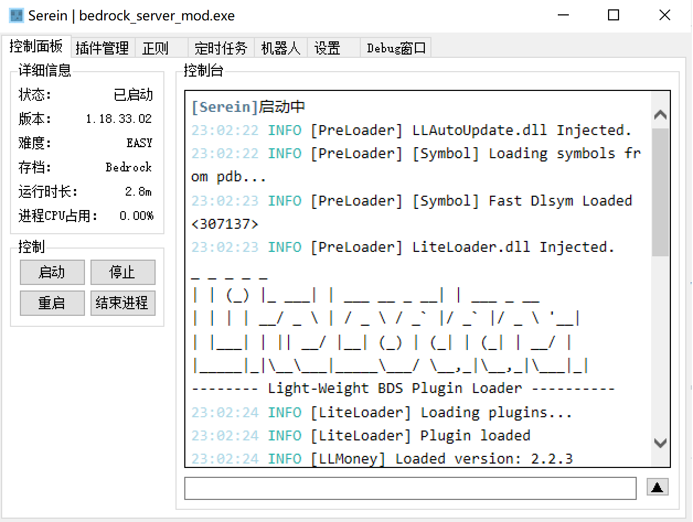
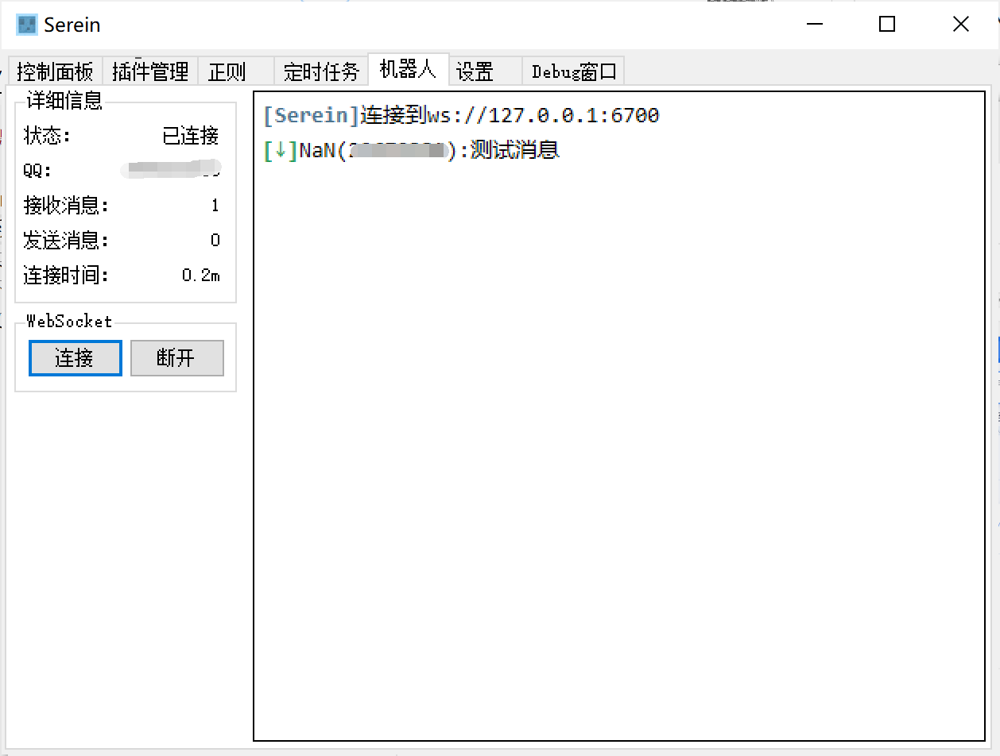
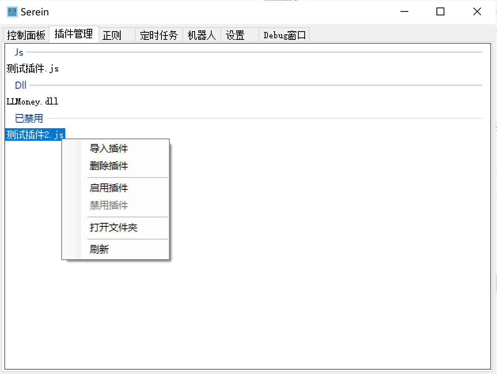
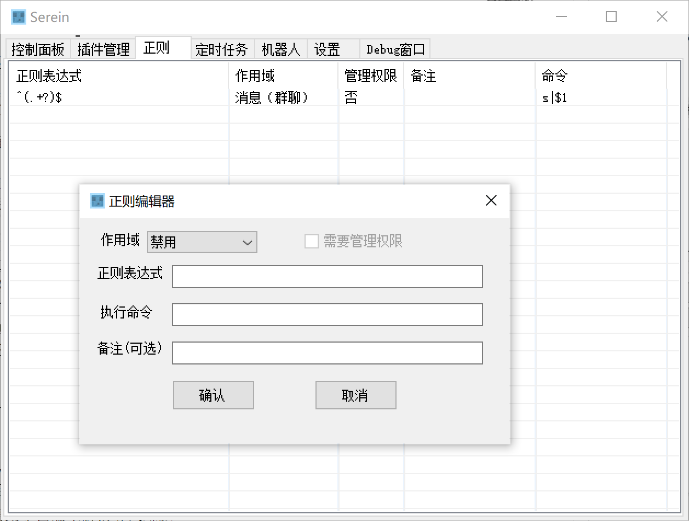
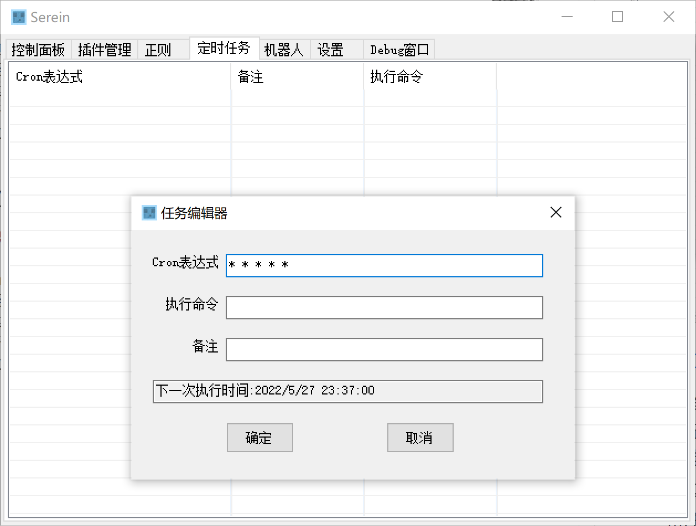
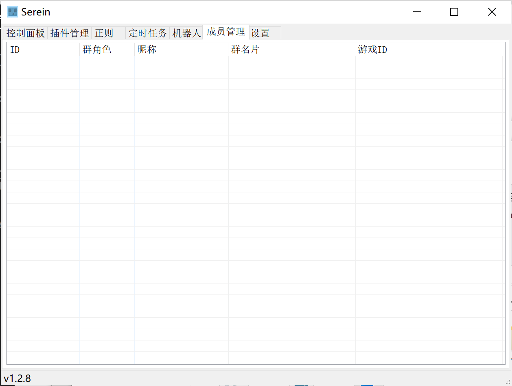
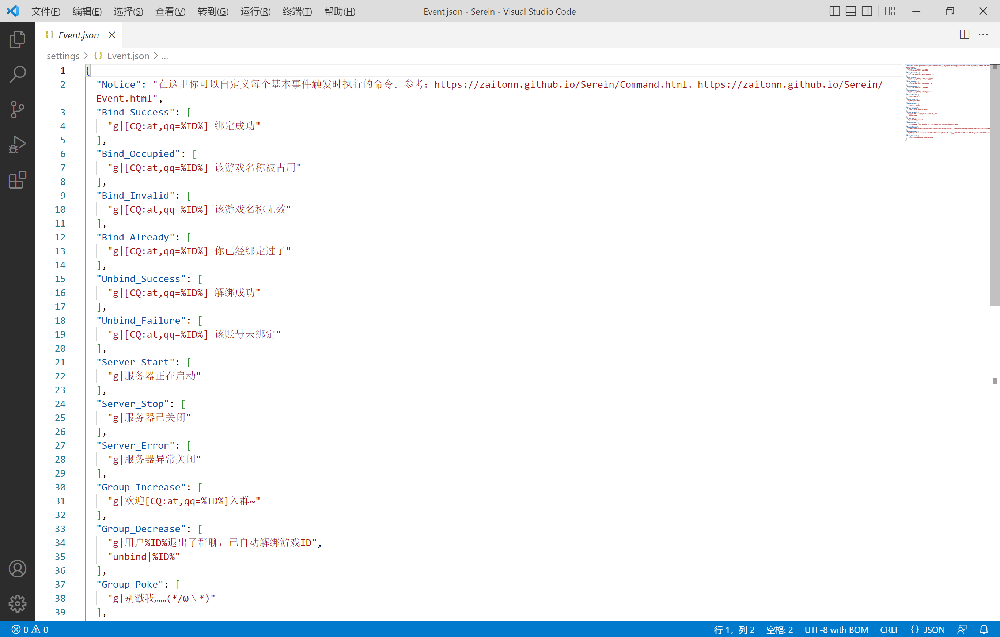

## 教程
- [教程](#教程)
  - [帮助改进文档](#帮助改进文档)
  - [安装Serein](#安装serein)
    - [Release](#release)
    - [Beta](#beta)
    - [自行编译](#自行编译)
    - [如何选择不同Net的版本](#如何选择不同net的版本)
  - [启动服务器](#启动服务器)
  - [自定义控制台样式](#自定义控制台样式)
  - [多开Serein](#多开serein)
  - [机器人](#机器人)
    - [支持的条件](#支持的条件)
    - [配置方法（以go-cqhttp为例）](#配置方法以go-cqhttp为例)
    - [鉴权](#鉴权)
  - [插件管理](#插件管理)
  - [正则](#正则)
    - [食用方法](#食用方法)
    - [功能介绍](#功能介绍)
      - [作用域](#作用域)
      - [正则表达式](#正则表达式)
      - [需要管理权限](#需要管理权限)
      - [执行命令](#执行命令)
      - [备注](#备注)
  - [定时任务](#定时任务)
    - [食用方法](#食用方法-1)
    - [功能介绍](#功能介绍-1)
      - [Cron表达式](#cron表达式)
      - [执行命令](#执行命令-1)
      - [备注](#备注-1)
  - [成员管理](#成员管理)
    - [食用方法](#食用方法-2)
  - [事件](#事件)
    - [这是个啥](#这是个啥)


### 帮助改进文档

>💖 **欢迎所有人提出建议或帮忙改进文档~** 💖  
不需要任何代码基础，只要有一颗奉献的心ヾ(•ω•`)o

- fork该项目后提交pr
- 进群直接向作者提出更改建议


### 安装Serein
#### Release
1. 从[Release](https://github.com/Zaitonn/Serein/releases/latest)下载Serein
2. 解压后双击运行`Serein.exe`

#### Beta
在[Action](https://github.com/Zaitonn/Serein/actions)下载最新的构建  

>#### ⚠ 提示
>Beta版不能保证稳定性，可能存在Bug，使用前务必自行备份

#### 自行编译
从[Release](https://github.com/Zaitonn/Serein/releaseslatest)下载`Source.zip`，使用vs或其他编译器编译运行（需要SDK）

#### 如何选择不同Net的版本
- .NET 6.0 
  - 运行速度较快，若追求处理速度可选择此版本 
  > 详见[Performance Improvements in .NET 6 （.NET 6 中的性能改进）](https://devblogs.microsoft.com/dotnet/performance-improvements-in-net-6/)

  - 系统一般不自带运行库，需自行安装 [`.NET 运行时`](https://dotnet.microsoft.com/download/dotnet/6.0/runtime/desktop/x64)

- .NET Framework 4.7.2
  - Win10及以上等大部分系统自带，可不需要手动安装，方便使用
    - 你也可以自行安装 [`.NET Framework`](https://dotnet.microsoft.com/zh-cn/download/dotnet-framework/net472)

### 启动服务器

>#### ⭐ Tips 
>- [BDS开服教程 - 手把手教你开服务器](https://www.minebbs.com/threads/bds.9518/)**（推荐）**  
>- [崩服 / 假死 / 卡顿情况排查与记录方法](https://www.minebbs.com/resources/bds.3403/)  
>- [BDS服务端 与 LiteLoaderBDS 新手教程 & 常见问答](https://www.minebbs.com/threads/bds-liteloaderbds.10265/)

1. 在[Minebbs](https://www.minebbs.com/)、[MCBBS](https://www.mcbbs.net/)下载你喜欢的整合包或在[官网](https://www.minecraft.net/zh-hans/download/server/bedrock)下载原版服务端，解压后打开目录
2. 设置为启动文件
   - 在`设置`>`服务器`>`启动文件`设置 
   - 将启动文件拖入窗口可直接识别设置
3. 点击`启动`按钮即可启动服务器


### 自定义控制台样式
1. 打开`./console`文件夹
2. 在Visual Studio Code或者其他编辑器中编辑其中的文件
3. 重启`Serein`后生效
>#### ⚠ 提示
>- `console.js`中定义的函数**不建议更改**，修改错误可能导致无法输出信息
>- 由于显示网页组件以IE为内核，内嵌网页需**适配IE浏览器**

### 多开Serein

> Mulit-Open，指在本地开启多个服务端并接入同一个机器人统一控制，适用于群组服等   

>#### ❗ 警告
>不建议直接多次双击`Serein.exe`来开启多个窗口，这可能**导致数据无法保存甚至崩溃**

```
│
├─文件夹1
│  │ Serein.exe  
│  └─...
├─文件夹2
│  │ Serein.exe  
│  └─...
└──文件夹3
   │ Serein.exe  
   └─...
```
1. 将`Serein.exe`上层文件夹复制多份，并重命名区分。目录结构如上所示
2. 分别启动其中的`Serein.exe`，选择不同的文件启动，可以独立保存数据和设置
3. 对于机器人你可以选择开启`上报自身消息`，通过对该消息进行匹配从而实现群组服消息互通
>#### ⚠ 提示
> 你需要对不同的`Serein`的正则或定时任务乃至设置进行相应配置，否则可能出现一呼百应的情况

### 机器人


#### 支持的条件
- 使用[OneBot-11](https://github.com/botuniverse/onebot-11)标准
  - 使用新[OneBot-12](https://12.onebot.dev/)标准的机器人不确定是否可用，可自行尝试
- 可使用WS正向连接


>#### ⚠ 提示
>- 由于不同机器人之间标准可能存在差异，不一定保证100%适配所有机器人 
>- 目前已完全支持的机器人：[`go-cqhttp`](https://github.com/Mrs4s/go-cqhttp)、[`OneBot Mirai`](https://github.com/yyuueexxiinngg/onebot-kotlin)  
>- **此处列举的机器人只代表已经经过测试且可用，并不是只有以上两种机器人可用，且不代表作者的个人观点**

#### 配置方法（以go-cqhttp为例）
1. 下载并运行，首次运行时会释放启动文件和配置文件
2. 再次运行，当出现提示选择通信方式时，选择`正向 Websocket 通信`
3. 在配置文件中填入账号和密码
4. 运行go-cqhttp登录帐号
5. 在`设置`>`机器人`>`Websocket地址`中设置与机器人配置文件中一致的地址 
6. 单击`机器人`>`连接`按钮连接机器人
   
>#### ⚠ 提示
>其他机器人可能需要直接修改配置文件，但操作方法类似


#### 鉴权
鉴权（authentication）是指验证用户是否拥有访问系统的权利。

在机器人的配置文件中设置`Access-Token`字段，可用防止ws服务器运行在公网时被任意客户端连接

此外，你还需要将`Access-Token`内容复制到`设置`>`机器人`>`鉴权凭证`，连接时在Websocket的Header添加Authorization字段用于鉴权  

>#### ⚠ 提示
>**`Access-Token`区分大小写、首尾空格等**


### 插件管理


- 在插件列表中右键打开菜单
   - `导入插件`
     - 打开选择文件窗口一键导入
   - `删除插件`
     - 永久删除所选文件
   - `启用插件` `禁用插件`
     - 以上两个功能实质是在插件的文件名后面增加`.lock`使加载器不能识别，并不更改插件文件内容
     - 禁用功能在服务器运行时不可用
   - `打开文件夹`
     - 在资源管理器中显示插件文件夹或所选插件
- 你也可以将所选插件直接拖入窗口，快捷导入插件


### 正则


正则数据保存在`data/regex.json`

- 例子下载：[Regex_Demo](Regex_Demo.html)


>#### ⭐ Tips 
>- 将他人的记录复制在该文件中以合并添加他人的正则
>- 直接将此文件分享给其他人供他人使用
>- 将数据文件拖入窗口覆盖导入正则，但是要注意**此操作不可逆**

#### 食用方法
在正则表格中右键打开菜单
- `新建记录`
- `修改记录`
- `删除记录`
  
>#### ⚠ 提示
>正则表达式或命令为空或不合法时无法保存

#### 功能介绍
##### 作用域
指定匹配的区域，可为以下五个值
1. `禁用` 不做任何匹配
2. `控制台` 匹配控制台
3. `消息（群聊）` 匹配群聊消息
4. `消息（私聊）` 匹配私聊消息
5. `消息（自身发送）` 匹配自身上报消息

>#### ❗ 警告
> 若选择`消息（自身发送）`，保存前请务必检查这条正则触发的命令是否会导致再次被所触发内容触发，配置错误可能导致机器人刷屏甚至被封号


##### 正则表达式
一种字符串匹配的模式，可以用来检查一个串是否含有某种子串、将匹配的子串替换或者从某个串中取出符合某个条件的子串等。


>#### ⭐ Tips 
>- [.NET 正则表达式  Microsoft Docs](https://docs.microsoft.com/zh-cn/dotnet/standard/base-types/regular-expressions)  
>- [C# 正则表达式  菜鸟教程](https://www.runoob.com/csharp/csharp-regular-expressions.html)


|  高级功能   | 可用性  |
|  -  | -  |
| **[替换已编号的组](https://docs.microsoft.com/zh-cn/dotnet/standard/base-types/substitutions-in-regular-expressions#substituting-a-numbered-group)**（`$1` `$114514`） | **可用** |
| [条件匹配的表达式](https://docs.microsoft.com/zh-cn/dotnet/standard/base-types/alternation-constructs-in-regular-expressions#conditional-matching-with-an-expression)  | **理论可用** |
| [基于有效的捕获组的条件匹配](https://docs.microsoft.com/zh-cn/dotnet/standard/base-types/alternation-constructs-in-regular-expressions#conditional-matching-based-on-a-valid-captured-group)  | **理论可用** |
| [替换命名组](https://docs.microsoft.com/zh-cn/dotnet/standard/base-types/substitutions-in-regular-expressions#substituting-a-named-group)  | *暂不可用* |
| [替换整个匹配项](https://docs.microsoft.com/zh-cn/dotnet/standard/base-types/substitutions-in-regular-expressions#substituting-the-entire-match)  | *暂不可用* |
| [替换匹配项前的文本](https://docs.microsoft.com/zh-cn/dotnet/standard/base-types/substitutions-in-regular-expressions#substituting-the-entire-match)  | *暂不可用* |
| [替换匹配项后的文本](https://docs.microsoft.com/zh-cn/dotnet/standard/base-types/substitutions-in-regular-expressions#substituting-the-text-after-the-match)  | *暂不可用* |
| [替换最后捕获的组](https://docs.microsoft.com/zh-cn/dotnet/standard/base-types/substitutions-in-regular-expressions#substituting-the-last-captured-group)  | *暂不可用* |
| [替换整个输入字符串](https://docs.microsoft.com/zh-cn/dotnet/standard/base-types/substitutions-in-regular-expressions#substituting-the-entire-input-string)  | *暂不可用* |

>#### ⚠ 提示
>由于功能限制，若无特别标记，正则表达式仅**匹配第一个符合条件的文本**   
>例：`(.+?)`匹配`我是一段文本`仅返回第一个字`我`（即使使用贪婪模式也是如此）    
>*解决方法：强制匹配整段文本`(.+?)`→`^(.+?)$`*


##### 需要管理权限
针对群聊消息和私聊消息

##### 执行命令
执行一条[Serein命令](Command.md)，你可以在其中插入[变量](Variables.md)

##### 备注
对这项内容的备注或注释，不影响匹配


  
```jsonc
{ // 示例文件
  "type": "REGEX",
  "comment": "非必要请不要直接修改文件，语法错误可能导致数据丢失",
  "data": [
    {
      "Regex": "^(.+?)$",  // 正则表达式
      "Remark": "",  // 备注
      "Command": "",  // 执行命令
      "Area": 0,  // 作用域
      "IsAdmin": false  // 需要管理权限 
    }
  ]
}
```

### 定时任务


任务数据保存在`data/task.json`

>#### ⭐ Tips 
>- 将他人的记录复制在该文件中以合并添加他人的任务
>- 直接将此文件分享给其他人供他人使用
>- 将数据文件拖入窗口覆盖导入任务，但是要注意**此操作不可逆**

#### 食用方法
在任务表格中右键打开菜单
- `添加任务`
- `修改任务`
  >#### ⭐ Tips 
  >在编辑窗口中你可以直接看到下一次的执行时间

  >#### ⚠ 提示
  >Cron表达式或命令为空或不合法时无法保存
- `删除任务`


#### 功能介绍
##### Cron表达式
指定任务执行的时间和周期

>#### ⭐ Tips 
>生成器（推荐）：[Crontab guru](https://crontab.guru/)  
>语法：[POSIX cron 语法](https://pubs.opengroup.org/onlinepubs/9699919799/utilities/crontab.html#tag_20_25_07) ，[Crontab Expression](https://github.com/atifaziz/NCrontab/wiki/Crontab-Expression) 

>#### ⚠ 提示
>为减少计算量，可能存在一定偏差（<4000ms），但不会叠加  
>例：假设一定时任务为`* * * * *`，代表在每一分钟执行该任务，但是可能在这分钟的第0秒到第4秒的任意时刻执行

##### 执行命令
执行一条[Serein命令](Command.md)，你可以在其中插入[变量](Variables.md)

##### 备注
对这项内容的备注或注释，不影响匹配


```jsonc
{  // 示例文件
  "type": "TASK",
  "comment": "非必要请不要直接修改文件，语法错误可能导致数据丢失",
  "data": [
    {
      "Cron": "* * * * *",  // Cron表达式
      "Command": "s|测试",  // 执行命令
      "Remark": "",  // 备注
      "Enable": true  // 启用
    }
  ]
}
```

### 成员管理



任务数据保存在`data/menbers.json`

#### 食用方法
- 通过触发命令[bind/unbind](Command.md#绑定游戏id)进行操作
  - 游戏ID校验正则：`^[a-zA-Z0-9_\s-]{4,16}$`
    - 长度为4-16
    - 仅含有大小写英文字符、下划线、空格
- 在列表中右键可编辑绑定的游戏ID或删除所选记录

```jsonc
{
  "type": "MEMBERS",
  "comment": "非必要请不要直接修改文件，语法错误可能导致数据丢失",
  "data": [
    {
      "ID": 10001, // QQ号
      "Card": "群名片",
      "Nickname": "昵称",
      "Role": 1, // 群角色类型，0=群主，1=管理员，2=普通群员
      "GameID": "1145141" // 游戏ID
    }
  ]
}
```

### 事件

#### 这是个啥
`Serein`可以根据`settings/Event.json`中的设置响应触发的事件  

>详见[事件](Event.md)



>#### ⭐ Tips 
>将来可能会有专用的编辑窗口